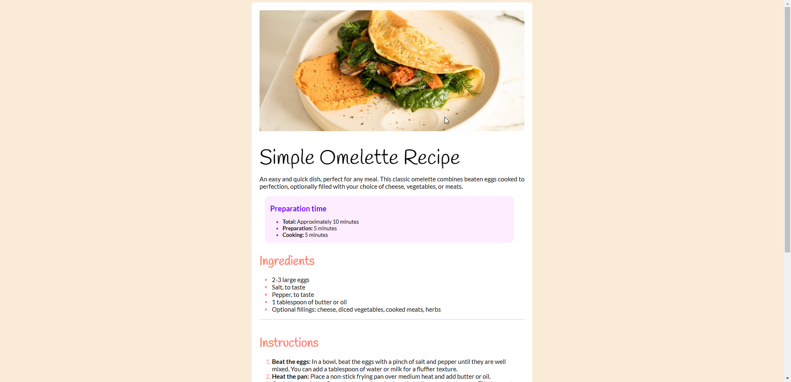
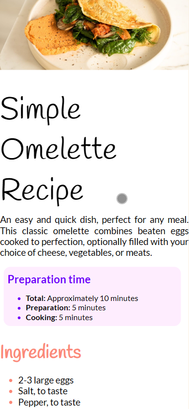

 Frontend Mentor - Recipe page solution

This is a solution to the [Recipe page challenge on Frontend Mentor](https://www.frontendmentor.io/challenges/recipe-page-KiTsR8QQKm). Frontend Mentor challenges help you improve your coding skills by building realistic projects. 

## Table of contents

- [Overview](#overview)
  - [The challenge](#the-challenge)
  - [Screenshot](#screenshot)
  - [Links](#links)
- [My process](#my-process)
  - [Built with](#built-with)
  - [What I learned](#what-i-learned)
- [Author](#author)

## Overview

### Screenshot

### Links

- Solution URL: [GITHUB repository](https://github.com/arthurdarros/recipe-page)
- Live Site URL: [Deploy Site](https://recipe-page-seven-dusky.vercel.app/)

## My process
-First i set all the HTML document, preparing for CSS using ID and Class to make easier for later
-After that i started the CSS setting the body to make a responsive website.
-Using the IDs and class i set the stylization to get close to the design project, but using some differents fonts and colors.
-And of course made the Media Query to be responsive with any device.
### Built with
- Semantic HTML5 markup
- CSS custom properties
- Flexbox
- Mobile-first workflow

### What I learned

I used most of the thinks i've already learned before, but i've learned how to use ::marker to stylize the markers of the lists.
But the greatest achivement is to see my progress and agility to solve the problems and get to the end of the project.

## Author

- Website - [Arthur](https://arthurdarros.github.io/)
- Frontend Mentor - [@arthurdarros](https://www.frontendmentor.io/profile/arthurdarros)

